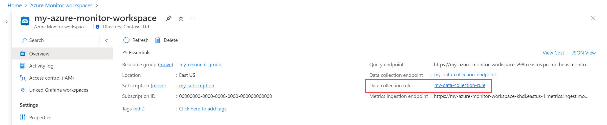

## Azure Monitor Workpace permissions

### Add write permissions
As an example, to write Azure Managed Prometheus metrics with help of AAD auth proxy you can follow these instructions.

The identity/application requires the *Monitoring Metrics Publisher* role on the data collection rule associated with your Azure Monitor workspace.
1.  From the menu of your Azure Monitor Workspace account, click the **Data collection rule** to open the **Overview** page for the data collection rule.

2. Click on **Access control (IAM)** in the **Overview** page for the data collection rule.

3. Click **Add** and then **Add role assignment**.

4. Select **Monitoring Metrics Publisher** role and click **Next**.

5. Select **User, group, or service principal** and then click **Select members**. Select your identity/application and click **Select**.

6. Click **Review + assign** to complete the role assignment.

### Add read permissions
As an example, to read Azure Managed Prometheus metrics with help of AAD auth proxy you can follow these instructions.

The identity/application requires the *Monitoring Data Reader* role on the Azure Monitor workspace. All the steps are similar to [Add write permissions](AZURE_MONITOR_PERMISSIONS.md#add-read-permissions), but add *Monitoring Data Reader* on  Azure Monitor workspace, instead of on data collection rule.