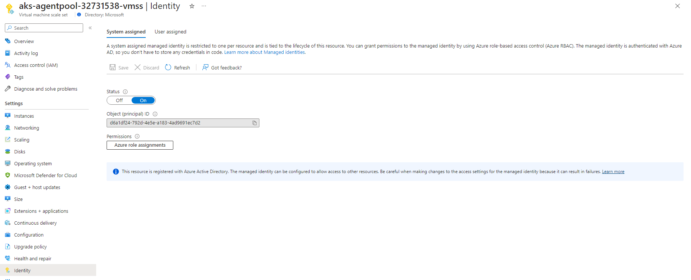

# Identity management
Proxy uses identity to authenticate requests and has 3 options: system assigned, user assigned and AAD application.
[Managed identity](https://learn.microsoft.com/azure/aks/use-managed-identity) can be enabled on [Azure Kubernetes service](https://learn.microsoft.com/azure/aks/intro-kubernetes), which can be used to authenticate requests.

## System identity
1. The node resource group of the AKS cluster contains resources that you will require for other steps in this process. This resource group has the name `MC_<AKS-RESOURCE-GROUP>_<AKS-CLUSTER-NAME>_<REGION>`. You can locate it from the **Resource groups** menu in the Azure portal. Start by making sure that you can locate this resource group since other steps below will refer to it.

2. Navigate to VMSS with the name `aks-agentpool-<ID>-vmss`. Select **Identity** TOC and **System assigned** tab, and toggle **Status** to **On**. This will enable system assigned identity on the underlying VMSS of AKS cluster.

3. **Object (principal) ID** should be used as [AAD_CLIENT_ID](GETTING_STARTED.md#parameters) when using [IDENTITY_TYPE](GETTING_STARTED.md#parameters) as **systemassigned**.

## User identity
1. Managed identity can be enabled on while [creating](https://learn.microsoft.com/azure/aks/use-managed-identity#create-an-aks-cluster-using-a-managed-identity) AKS or can be [updated](https://learn.microsoft.com/azure/aks/use-managed-identity#update-an-aks-cluster-to-use-a-managed-identity) at a later point in time.
2. Run command `az aks show -g <AKS-CLUSTER-RESOURCE-GROUP> -n <AKS-CLUSTER-NAME> --query "identityProfile"` and pick `kubeletidentity.clientId`. This should be used as [AAD_CLIENT_ID](GETTING_STARTED.md#parameters) when using [IDENTITY_TYPE](GETTING_STARTED.md#parameters) as **userassigned**.

## AAD application
1. Follow the procedure at [Register an application with Azure AD and create a service principal](https://learn.microsoft.com/azure/active-directory/develop/howto-create-service-principal-portal#register-an-application-with-azure-ad-and-create-a-service-principal) to register an application for Prometheus remote-write and create a service principal.
2. From the **Azure Active Directory** menu in Azure Portal, select **App registrations**. Locate your application and note the client ID. This should be used as [AAD_CLIENT_ID](GETTING_STARTED.md#parameters) when using [IDENTITY_TYPE](GETTING_STARTED.md#parameters) as **aadapplication**.


## Azure Monitor Workpace permissions
### Add write permissions
The identity/application requires the *Monitoring Metrics Publisher* role on the data collection rule associated with your Azure Monitor workspace.
1.  From the menu of your Azure Monitor Workspace account, click the **Data collection rule** to open the **Overview** page for the data collection rule.

2. Click on **Access control (IAM)** in the **Overview** page for the data collection rule.

3. Click **Add** and then **Add role assignment**.

4. Select **Monitoring Metrics Publisher** role and click **Next**.

5. Select **User, group, or service principal** and then click **Select members**. Select your identity/application and click **Select**.

6. Click **Review + assign** to complete the role assignment.

### Add read permissions
The identity/application requires the *Monitoring Data Reader* role on the Azure Monitor workspace. All the steps are similar to [Add write permissions](#add-write-permissions), but add *Monitoring Data Reader* on  Azure Monitor workspace, instead of on data collection rule.

## Set up CSI driver for certificate management
*Note: Azure Key Vault CSI driver configuration is just one of the ways to get certificate mounted on the pod. Proxy container only needs a local path to a certificate in the pod for the setting `AAD_CLIENT_CERTIFICATE_PATH` when using AAD application tpe for authenticating requests.*

This step is only required if you didn't enable Azure Key Vault Provider for Secrets Store CSI Driver when you created your cluster.
1. Run the following Azure CLI command to enable Azure Key Vault Provider for Secrets Store CSI Driver for your cluster. `az aks enable-addons --addons azure-keyvault-secrets-provider --name <aks-cluster-name> --resource-group <resource-group-name>`
2. Run the following commands to give the identity access to the key vault.
    ```azurecli
    # show client id of the managed identity of the cluster
    az aks show -g <resource-group> -n <cluster-name> --query addonProfiles.azureKeyvaultSecretsProvider.identity.clientId -o tsv

    # set policy to access keys in your key vault
    az keyvault set-policy -n <keyvault-name> --key-permissions get --spn <identity-client-id>

    # set policy to access secrets in your key vault
    az keyvault set-policy -n <keyvault-name> --secret-permissions get --spn <identity-client-id>
    
    # set policy to access certs in your key vault
    az keyvault set-policy -n <keyvault-name> --certificate-permissions get --spn <identity-client-id>
    ```
3.  Create a *SecretProviderClass* by saving the following YAML to a file named *secretproviderclass.yml*. Replace the values for `userAssignedIdentityID`, `keyvaultName`, `tenantId` and the objects to retrieve from your key vault. See [Provide an identity to access the Azure Key Vault Provider for Secrets Store CSI Driver](https://learn.microsoft.com/azure/aks/csi-secrets-store-identity-access) for details on values to use.

    ```yml
    # This is a SecretProviderClass example using user-assigned identity to access your key vault
    apiVersion: secrets-store.csi.x-k8s.io/v1
    kind: SecretProviderClass
    metadata:
    name: azure-kvname-user-msi
    spec:
    provider: azure
    parameters:
        usePodIdentity: "false"
        useVMManagedIdentity: "true"          # Set to true for using managed identity
        userAssignedIdentityID:  <client-id> # Set the clientID of the user-assigned managed identity to use
        keyvaultName: <key-vault-name> # Set to the name of your key vault
        cloudName: ""                         # [OPTIONAL for Azure] if not provided, the Azure environment defaults to AzurePublicCloud
        objects:  |
        array:
            - |
            objectName: <name-of-cert>
            objectType: secret        # object types: secret, key, or cert
            objectFormat: pfx
            objectEncoding: base64
            objectVersion: ""
        tenantId: <tenant-id> # The tenant ID of the key vault
    ```
4. Apply the *SecretProviderClass* by running the following command on your cluster.

    `
    kubectl apply -f secretproviderclass.yml
    `

