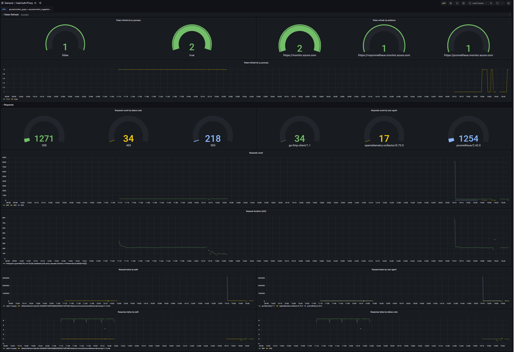

# Telemetry
Proxy is instrumented with [OTEL](https://opentelemetry.io/) and will emit metrics and traces. To collect them [OTEL Collector](https://github.com/open-telemetry/opentelemetry-collector) needs to deployed and configured.

## List of traces
1. Proxy request: requests are forwarded using this path. Successful request will have 3 spans:
    - ProxyRequest: This is the entry point.
    - modifyRequest: This is where proxy will modify host and add BearerToken.
    - modifyResponse: This is where proxy validates response.
2. Access token refresh: This path is used by background thread to refresh token periodically.
3. Readiness check: This path is used by liveness and readiness checks. 

## List of metrics
| Metric name | Type | Labels | Description |
| ------- | ------- | ------- | ----------- |
| aad_auth_proxy_requests_total | counter | target_host, method, path, user_agent, status_code | A counter of total number of requests the proxy has received. This is incremented when response for a given request is received or failed to forward request. |
| aad_auth_proxy_request_duration_milliseconds | histogram | target_host, method, path, user_agent, status_code | A histogram of request to response duration. This calculated as the time duration between the time request was received and response was returned back to client. |
| aad_auth_proxy_request_bytes_total | counter | target_host, method, path, user_agent | A counter of total number of bytes received in incoming request. This is updated when request is received. |
| aad_auth_proxy_response_bytes_total | counter | target_host, method, path, user_agent, status_code | A counter of total number of bytes received in response. This is updated when response is received. |
| aad_auth_proxy_token_refresh_total | counter | audience, client_id, tenant_id, identity_type, is_success | A counter of total number of token refreshes. This is updated when token is refreshed. |

*Note: Since aad_auth_proxy_request_duration_milliseconds is of type histogram it will emit three metrics*
- *aad_auth_proxy_request_duration_milliseconds_bucket*
- *aad_auth_proxy_request_duration_milliseconds_count*
- *aad_auth_proxy_request_duration_milliseconds_sum*

## Grafana
[Grafana dashboard](../dashboards/grafana-dashboard.json) can be used to visualize metrics. Job dropdown contains value of the config parameter [OTEL_SERVICE_NAME](GETTING_STARTED.md#parameters) specified in proxy config. In case multiple proxies send metrics to the same store, customer may need to choose particular instance of the proxy in this dropdown.

## Sample OTEL Config
[OTEL Collector](https://github.com/open-telemetry/opentelemetry-collector) to receive and export telemetry. [sample-otel-collector-config.yaml](../samples/sample-otel-collector-config.yaml) shows that we are receiving traces and metrics via grpc. 
Traces are being exported to [Jaeger tracing](https://www.jaegertracing.io/) and to [Application Insights](https://learn.microsoft.com/en-us/azure/azure-monitor/app/app-insights-overview?tabs=net) via [Azure Monitor exporter](https://github.com/open-telemetry/opentelemetry-collector-contrib/tree/main/exporter/azuremonitorexporter).
Metrics are being exported to [Azure Monitor Workspace](https://learn.microsoft.com/en-Us/azure/azure-monitor/essentials/azure-monitor-workspace-overview) via another proxy deployment in ingestion mode using prometheus remote write.