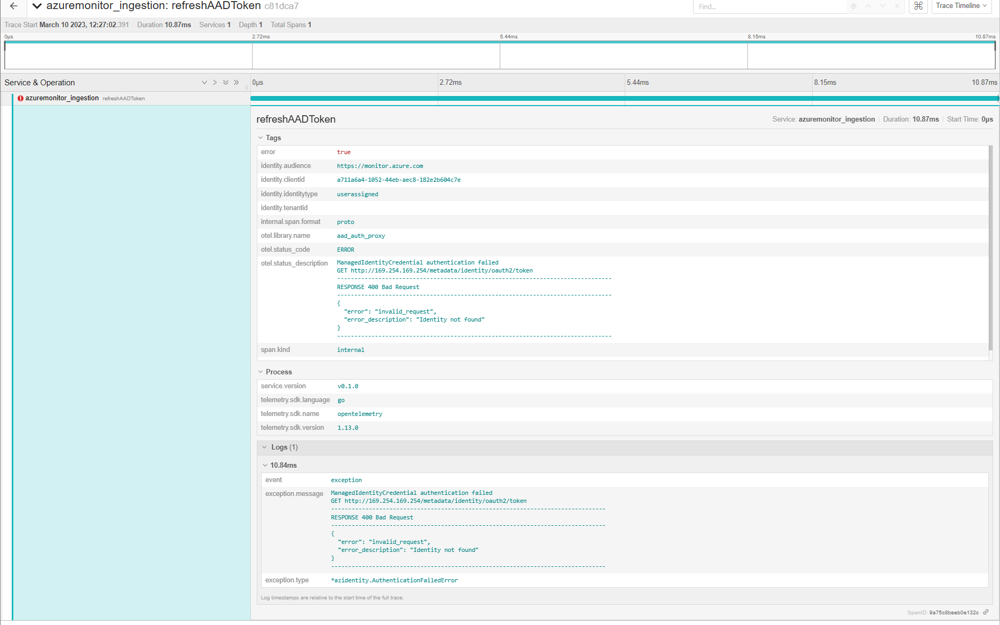
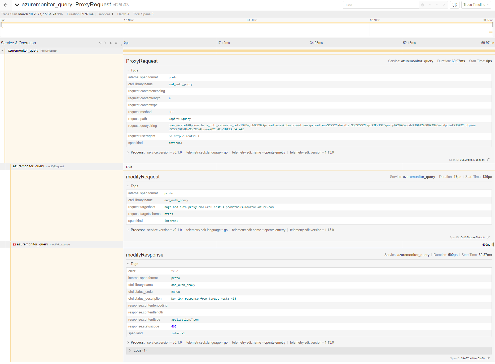

# Troubleshooting 

## 1. Proxy container does not start 
Run the following command which will indicate the errors if any in proxy container.

`
kubectl --namespace <Namespace> describe pod <Prometheus-Pod-Name>
`
## 2. Proxy does not start due to wrong configuration
Proxy checks for valid identity to fetch token during start up, if this fails, start up will fail as well. Errors will be logged and can be viewed by running command

`
kubectl --namespace <Namespace> logs <Proxy-Pod-Name>
`

### refrehAADToken failure trace
In this scenrio, you would see refrehAADToken failure in traces, example below:

## 3. Proxy unable to renew token after a while
In this scenario, you would see traces similar to [refrehAADToken failure trace](#refrehaadtoken-failure-trace), logs will also be logged and proxy will periodically try to fetch token.

### ProxyRequest failure trace
In this scenario, you would also start seeing ProxyRequest failures similar to below trace.

*Note: If proxy container is running and OTEL is configured to collect telemetry, [grafana dashboard](./TELEMETRY.md#grafana) and traces can be used as resources to identify errors.*